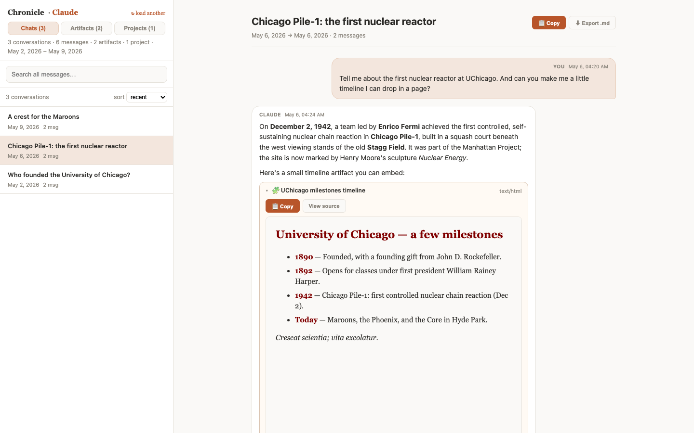

# Chronicle

A local toolkit for your exported **Claude** or **ChatGPT** history. Everything
runs on your own machine — your data never leaves your device unless you choose
to upload it. Two things it does:

1. **View** — a threaded, full-text-searchable viewer for browsing your export.
2. **Migrate** — turn your history into per-project knowledge documents +
   memory blocks you can load into **Claude Enterprise** (or anywhere else).
   See **[MIGRATE.md](MIGRATE.md)** for the step-by-step guide. *(Requires
   [Claude Code](https://claude.com/claude-code), which does the summarizing.)*


*The standalone viewer: a sample Claude export with a rendered HTML artifact.*

**Just want to see it?** Run `python samples/build_samples.py` to generate two
fake, UChicago-themed sample exports (Claude + ChatGPT — with chats, a project,
and artifacts) and drag one into the viewer. See **[samples/](samples/)**.

---

## Viewer

A local, threaded, full-text-searchable viewer for your exported **Claude** or
**ChatGPT** history. Everything runs in your browser — your data never leaves
your device.

There are two ways to run it:

- **Standalone single file** (`conversations-viewer.html`) — no install, no
  server, runs entirely in the browser. This is the version to **share with
  other people** so they can browse their own exports. See below.
- **Local server** (`app.py`) — the original Flask + SQLite version, best for
  very large exports. Documented further down. Its UI is **feature-frozen**:
  new viewer features land only in the standalone file; the server version
  gets correctness and security fixes only.

---

## Standalone single-file viewer (shareable)

`conversations-viewer.html` is fully self-contained: open it in any browser,
choose your Claude or ChatGPT export, and everything (parsing, search,
threading, Markdown) happens locally. **Your data never leaves your device** —
no upload, no server, works offline. The only file a recipient needs is that
one HTML file.

One caveat to "works offline": the page's own code is blocked (by a
Content-Security-Policy) from sending data anywhere, but if you open an
HTML/React **artifact** from your history, that artifact may load its own
display libraries from a CDN. Everything else — including all images — is
fully local.

### For an end user

1. Download your data:
   - **Claude:** Settings → Privacy → Export data.
   - **ChatGPT:** Settings → Data controls → Export data.

   Either way you'll get a `.zip` by email.
2. Open `conversations-viewer.html` in any modern browser (double-click).
3. Drag the `.zip` anywhere on the page, or click **Choose export…**. Chronicle
   detects whether it's a Claude or ChatGPT export automatically.

That's it — no Python, no install, no internet.

#### Projects

The viewer has a **Chats / Projects** tab switcher. The downloadable export
zip only contains conversations, **not** projects — projects come as a separate
`projects/` folder (one JSON file per project, each with the project's
instructions and documents). To view them, click **Load projects folder…** on
the landing screen (or the Projects tab) and pick that `projects/` folder. Each
project shows its instructions (rendered Markdown) and its documents (expandable,
loaded on demand since some hold large extracted text). If a future export zip
ever bundles `projects/*.json`, the viewer ingests those automatically too.

#### ChatGPT exports

Chronicle reads ChatGPT exports too — drag the whole `.zip` and the format is
detected automatically. A few differences from Claude:

- ChatGPT splits conversations across several files (`conversations-000.json`,
  `conversations-001.json`, …); Chronicle merges them on load.
- **Images** you sent or that ChatGPT generated are decoded from the export's
  asset files (`*.dat`, mapped via `conversation_asset_file_names.json`) and
  shown inline in the conversation.
- The reply tree is rebuilt from each message's `parent` pointer; hidden
  system/empty nodes are skipped.
- Conversation dates come from the message timestamps (ChatGPT sometimes stamps
  a chat's top-level date with the export date instead of the real one).
- ChatGPT exports have **no projects or artifacts**, so those tabs stay empty
  for them, and the assistant is labeled "ChatGPT" rather than "Claude".

#### What you'll see

- **Artifacts, generated files, and uploaded documents** are shown as their own
  in-bubble cards:
  - **Artifacts** Claude built (🧩) and **files Claude created** (📄) render by
    type: Markdown as formatted text, **HTML in a sandboxed iframe** (with a
    *View source* toggle), **SVG as an image**, everything else as code.
  - Any card shown as **raw code** carries a short explanation that it's the
    stored code, not the rendered result, and a **📋 Copy** button — paste it
    into a new Claude chat and say "Run this" to recreate the output.
    **Document-generator scripts** (Node `docx`/`pptxgenjs`/Excel, Python
    `python-docx`/`reportlab`, etc.) get a more specific version naming the file
    type, since the rendered Word/Excel/PDF is the program's *output* and **is
    not in Anthropic's export** — only the generating code is.
  - **Uploaded documents** (📎) with extracted text are collapsible; uploads
    whose content isn't in the export are shown as a labeled reference.
  All of this content is included in the search.
- A one-time **overview banner** appears atop the first conversation you open,
  summarizing the raw-content situation. Dismissing it ("Got it") is remembered
  across sessions (`localStorage`).
- The **Projects** view has the same treatment: its own one-time overview
  banner, a **📋 Copy** button on the project instructions, and document cards
  with a Copy button plus a note that the text is extracted (the original file
  isn't in the export). Markdown/HTML/SVG project documents render in place.

### To build it (for the person packaging/sharing)

```sh
python build_standalone.py    # inlines the vendored libs -> conversations-viewer.html
```

The build inlines three vendored libraries from `static/` into the single
output file: `marked` (Markdown), `DOMPurify` (sanitizing), and `fflate`
(reading the export `.zip` directly). Search is a pure in-browser scan, so
there's no SQLite/WASM dependency. Note: very large exports (100 MB+) are
parsed in memory on load, which takes a few seconds and some RAM.

---

## Migrate: summarize your projects into a new account

Chronicle can turn an export into per-project **knowledge documents** and
**memory blocks** — Claude-written summaries of every chat — that you upload
into a fresh Claude Enterprise account (or any other tool). A Claude export
has every chat but no record of which chats belonged to which project, so
there's one manual step (you map chats → projects); the rest is automated.

The pipeline (full walkthrough in **[MIGRATE.md](MIGRATE.md)**) works on
**Claude and ChatGPT exports** alike:

1. **map** — **`propose-map`** drafts the chat→project mapping automatically
   (with a confidence report to review), or list chats yourself with
   **`list`** + `project_listings/` and resolve via **`build-map`**.
2. **`prepare`** — extract one full transcript per chat.
3. **`scrub`** — scan the transcripts for secrets/PII before anything moves
   (report first, `--apply` to redact).
4. **briefs** — Claude Code summarizes each transcript into a `.brief.md`
   (pick a style in `prompts/`).
5. **synthesis** — Claude Code writes a cross-chat memory block per project,
   and optionally a global **persona** block (`prompts/persona.md`).
6. **`assemble`** — produces `out/<project>.md` (knowledge doc, auto-split
   with `--max-chars`), `out/<project>.memory.md` (memory), and
   `out/persona.md`.

Also in the toolbox: **`resume`** (paste-ready primers for threads you were
in the middle of), **`rehydrate`** (recover generated Word/Excel/PDF files by
re-running their stored generator scripts — opt-in `--run`), and **`export`**
(write any supported zip in the canonical format, see
**[FORMAT.md](FORMAT.md)**, with an optional Markdown cold-storage archive).

Then, in the new account: create the project, upload `<project>.md` as project
knowledge, and paste `<project>.memory.md` into its instructions. The
summarizing runs in your own Claude Code — nothing is uploaded until you import
it. *(Requires [Claude Code](https://claude.com/claude-code).)*

---

## MCP server: your archive as live memory

Instead of only migrating summaries, you can serve the full indexed history
to any MCP client (Claude Desktop, Claude Code, ...) — everything stays on
your machine:

```sh
pip install ".[mcp]"
python build_index.py        # builds conversations.db from conversations.json
python mcp_server.py         # stdio MCP server over the database
```

Tools exposed: `search` (full-text, ranked, covers artifact and attachment
content), `list_conversations`, `get_conversation` (Markdown transcript),
`list_artifacts` / `get_artifact`, `stats`. Client config snippet is in
`mcp_server.py`'s docstring.

---

## Local server version

## Setup

```sh
pip install ".[server]"      # installs flask (the rest of Chronicle is stdlib-only)
python build_index.py        # builds conversations.db (~38 MB, <1s)
python app.py                # serves http://127.0.0.1:5050
```

Open http://127.0.0.1:5050.

Re-run `build_index.py` whenever `conversations.json` changes. Set a
different port with `PORT=8000 python app.py` (5000 is taken by macOS
AirPlay Receiver).

## What the server viewer does

- **Sidebar** lists every conversation; sort by recent / oldest / title.
- **Search** runs SQLite FTS5 full-text search across message bodies, thinking
  blocks, uploaded-attachment text, and the content of artifacts and files
  Claude created. Results are ranked by per-conversation hit count (a title
  match is flagged separately and doesn't inflate the count), with a
  highlighted snippet. The last word is treated as a prefix (`embed` matches
  `embedding`).
- **Threaded view** reconstructs the reply tree from `parent_message_uuid`.
  Linear chats render flat; branched conversations show each branch indented
  under a `branch N` rail and are tagged `⑂ branched thread`.
- **Chat-bubble layout**: your messages align right, Claude's align left
  (texting-app style).
- **Markdown rendering**: message bodies and thinking blocks are rendered as
  Markdown (headers, lists, tables, fenced code) via `marked`, sanitized with
  `DOMPurify`. Both are vendored under `static/` so the app works offline.
- Per message: assistant **thinking** is collapsible, **tool** calls
  (`web_search`, etc.) show as chips, search terms are highlighted in the body
  (highlighting skips code blocks).
- **Deep links**: the URL reflects state, e.g.
  `/?q=minitel&open=<conversation-uuid>` — shareable and reloadable.

Richer features — artifact and document cards, the overview banners, the
Artifacts/Library/Projects tabs, copy/export buttons — live in the standalone
viewer (see above); they are not part of the server UI.

## Files

| File | Purpose |
|---|---|
| `build_index.py` | Parses the JSON export into `conversations.db` (SQLite + FTS5). |
| `app.py` | Flask server: `/`, `/api/conversations`, `/api/search`, `/api/conversation/<uuid>`, `/api/stats`. |
| `templates/index.html` | Single-page UI (no build step). |
| `synopsis.py` | Migration tool: `list` / `propose-map` / `build-map` / `prepare` / `scrub` / `assemble` / `resume` / `rehydrate` / `export` (see [MIGRATE.md](MIGRATE.md)). |
| `chatgpt_export.py` | Normalizes ChatGPT exports into the canonical schema ([FORMAT.md](FORMAT.md)). |
| `store.py` | Read-only query layer over `conversations.db`. |
| `mcp_server.py` | MCP server exposing the archive to any MCP client. Needs `pip install ".[mcp]"`. |
| `prompts/` | Copy-paste prompts: capture a project's chat list, and the brief/synthesis styles. |
| `build_userguide.py` | Generates the Word user guide, "Chronicle - User Guide.docx". Needs `pip install ".[docs]"`. |

The export itself (`conversations.json`), the generated `conversations.db`, and
all migration inputs/outputs (`project_listings/`, `map.json`, `work/`, `out/`)
are git-ignored and not meant to be committed.

## Found a bug?

Open an issue at <https://github.com/kemalbadur/chronicle/issues> — ideally
with the smallest export snippet that reproduces it (**scrubbed of anything
personal**; `samples/build_samples.py` shows the shape of a safe fake export).
Pull requests run the test suite and viewer-freshness check automatically.

## Development

```sh
pip install -e ".[server,docs,dev]"
python -m pytest                 # run the test suite
ruff check .                     # lint
python build_standalone.py      # rebuild conversations-viewer.html after editing viewer.template.html
```

CI verifies that `conversations-viewer.html` is up to date with
`viewer.template.html` — always rebuild and commit both together.
